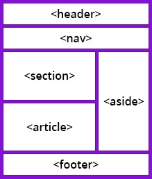

# Horiseon Webpage: Refactoring

## Description

The purpose of this project was to **refactor** the existing code within the HTML to use semantic elements. This was designed to help the marketing agency, Horiseon, improve their accessibility standards so that their webpage is optimised for search engines. Throughout this project, I was able to learn about semantic HTML elements and the use of accessibility elements.

## Table of Contents

- [Installation](#installation)
- [Usage](#usage)
- [Credits](#credits)
- [License](#license)

## Installation

The following image shows the structure and elements of a Semantic HTML webpage:



In order to follow this structure, the original code of the HTML had to be refactored. Below are a few of the steps taken.

- **Updating the header section**
```
    <div class="header">
        <h1>Hori<span class="seo">seo</span>n</h1>
        <div>
            <ul>
                <li>
                    <a href="#search-engine-optimization">Search Engine Optimization</a>
                </li>
                <li>
                    <a href="#online-reputation-management">Online Reputation Management</a>
                </li>
                <li>
                    <a href="#social-media-marketing">Social Media Marketing</a>
                </li>
            </ul>
        </div>
    </div>
```
Throughout the header section, div and span elements were used. To reflect the structure and elements of Semantic HTML, the code was refactored with the use of header and nav elements.

```
    <header class="header">
        <h1>Hori<h1 class="seo">seo</h1><h1>n</h1>
        <nav class="nav-bar">
            <ul class="ul">
                <li class="li">
                    <a href="#search-engine-optimization">Search Engine Optimization</a>
                </li>
                <li class="li">
                    <a href="#online-reputation-management">Online Reputation Management</a>
                </li>
                <li class="li">
                    <a href="#social-media-marketing">Social Media Marketing</a>
                </li>
            </ul>
        </nav>
    </header>
```
- **Updating the Content Section**
```
    <div class="hero"></div>
    <div class="content">
        <div class="search-engine-optimization">
            
            <h2>Search Engine Optimization</h2>
            <p>
                The dominance of mobile internet use means that users are searching for the right business as they travel, shop, or sit on their couch at home. Search Engine Optimization (SEO) allows you to increase your visibility and find the right customers for your business.
            </p>
        </div>
```
The content section had div elements throughout. The images within this section had no accessibility features. Accessibility features are a requirement for Horiseon so that their webpage follows accessibility standards.
```
        <article id="search-engine-optimization" class="search-engine-optimization">
            <figure>
            
            </figure>
            <h2>Search Engine Optimization</h2>
            <p>
                The dominance of mobile internet use means that users are searching for the right business as they travel, shop, or sit on their couch at home. Search Engine Optimization (SEO) allows you to increase your visibility and find the right customers for your business.
            </p>
        </article>
```
The div elements are now updated to define the section of the webpage and the articles, this being the independent, self-contained content. A figure element has been used to specify the images and the images now contain an alt attribute, to increase the webpage's accessibility. The code for the "search-engine-optimization" line has also been updated from a class element to an ID element. This enabled the hyperlink within the navigation bar to take the user to the Search Engine Optimization section. This helps the long-term sustainability.
- **Updating the Benefits section**
```
    <div class="benefits">
        <div class="benefit-lead">
            <h3>Lead Generation</h3>
            
            <p>
                Inbound strategies for lead generation require less work for your business, bringing customers directly to your website.
            </p>
        </div>
```
More div elements within the Benefits section. As with the Content section, the images had no accessibility features.
```
    <aside class="benefits">
        <aside class="benefit-lead">
            <h3>Lead Generation</h3>
            <figure>
            
            </figure>
            <p>
                Inbound strategies for lead generation require less work for your business, bringing customers directly to your website.
            </p>
        </aside>
```
Div elements have been refactored to be aside elements. This is due to the content being aside from the content it is placed in (like a sidebar). Images have a figure element applied to speicify the image and they also contain an alt attribute, in order to meet accessibility standards.
- **Updating the Footer**
```
    <div class="footer">
        <h2>Made with ❤️️ by Horiseon</h2>
        <p>
            &copy; 2019 Horiseon Social Solution Services, Inc.
        </p>
    </div>
```
Div element was used for the footer.
```
    <footer class="footer">
        <h2>Made with ❤️️ by Horiseon</h2>
        <p>
            &copy; 2019 Horiseon Social Solution Services, Inc.
        </p>
    </footer>
```
Div element is replaced by a footer element as this defines the footer for the document.
## Usage
In full application with the refactoring of the code, the webpage keeps the structure and theme of the original code, but now has the semantic HTML elements in place. See below for screenshot of the webpage and page source


The hyperlinks in the navigation bar are now fully functional and take you to the correct location on the webpage.

Lastly, you can see the accessibility features in use, which is depicted by the alt text displaying when the image fails to load.

## Credits
- [Horiseon Webpage](https://bdjm94.github.io/01-horiseon-webpage/)
- [GitHub Repository](https://github.com/bdjm94/horiseon-webpage.git)
- [Understanding Semantic HTML Elements](https://www.w3schools.com/html/html5_semantic_elements.asp)
- [Understanding alt attributes](https://www.w3.org/TR/WCAG20-TECHS/H37.html)
## License
[](https://choosealicense.com/licenses/mit/)